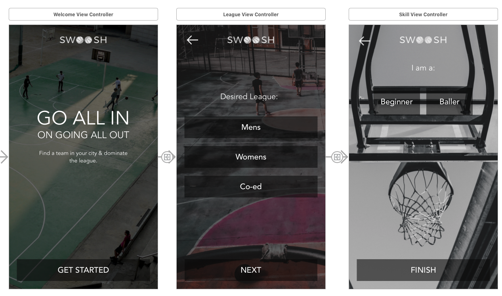

# Swoosh App
------------------------------------------------------

Udemy Course: iOS 11 & Swift 4: From Beginner to Paid Professional

_Concepts learned:_
- Auto-Layout 
- Stack views
- Segues 
- Passing data between viewcontrollers 
